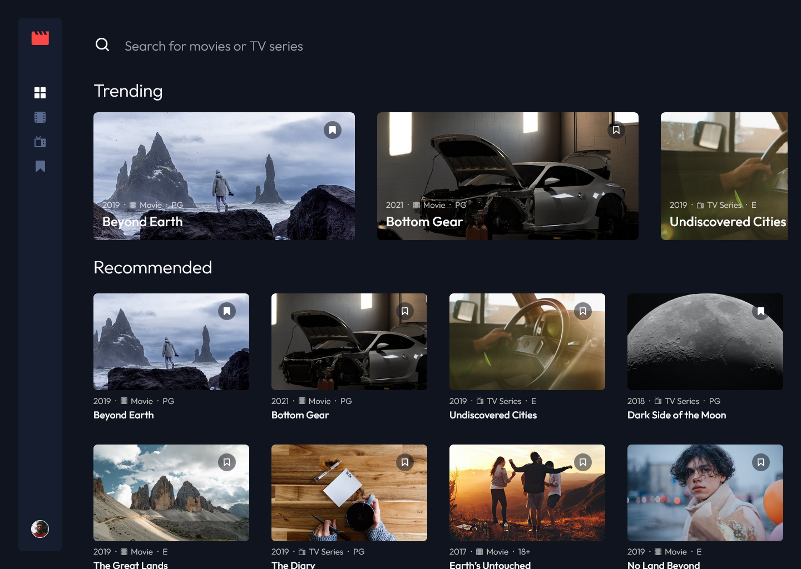

# Frontend Mentor - Entertainment web app solution

This is a solution to the [Entertainment web app challenge on Frontend Mentor](https://www.frontendmentor.io/challenges/entertainment-web-app-J-UhgAW1X). Frontend Mentor challenges help you improve your coding skills by building realistic project.

## Table of contents

- [Overview](#overview)
  - [The challenge](#the-challenge)
  - [Screenshot](#screenshot)
  - [Links](#links)
- [My process](#my-process)
  - [Built with](#built-with)
  - [What I learned](#what-i-learned)
  - [Difficulties](#difficulties)
- [Author](#author)
- [Acknowledgments](#acknowledgments)

## Overview

### The challenge

Users should be able to:

- View the optimal layout for the app depending on their device's screen size
- See hover states for all interactive elements on the page
- Navigate between Home, Movies, TV Series, and Bookmarked Shows pages
- Add/Remove bookmarks from all movies and TV series
- Search for relevant shows on all pages

### Screenshot

#### Desktop View :

#### Tablet View :

#### Mobile View :

### Links

- [Solution URL](https://www.frontendmentor.io/solutions/entertainment-web-app-using-reactjs-and-tailwindcss-FmtoPLmQZi)
- [Live Site URL](https://earthyy-entertainment-web-app.netlify.app/)

## My process

### Built with

- [React](https://reactjs.org/) - JS library
- [React Router](https://reactrouter.com/) - Declarative routing for React
- [Redux Toolkit](https://redux-toolkit.js.org/) - Toolset for efficient Redux development
- [TailwindCSS](https://tailwindcss.com/) - CSS framework
- [Vite](https://vitejs.dev/) - Frontend build tool

### What I learned

This was my first time using TailwindCSS and I really enjoyed it. I was able to get a lot of things done quickly and easily. I also learned how to use React Router and Redux Toolkit. 

### Difficulties

Despite putting significant effort and experimenting with various approaches, I faced challenges while implementing the overflow property to enable both horizontal and vertical scrolling for the trending and recommended sections. Although I eventually found a solution, I remain dissatisfied with the final outcome and would like to explore more efficient methods to accomplish this feature.

## Author

- Frontend Mentor - [@Earthyyy](https://www.frontendmentor.io/profile/Earthyyy)
- Github - [@Earthyy](https://github.com/Earthyyy)

## Acknowledgments

Big Thanks <3 to :

* [Kevin Powell](https://www.youtube.com/@KevinPowell)
* [Codecademy](https://www.codecademy.com)
* [Frontend Mentor](https://www.frontendmentor.io/)
